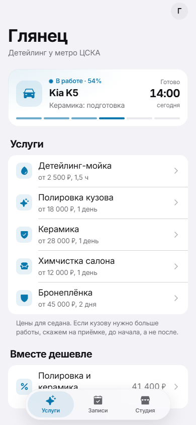

# Глянец — запись на детейлинг в Telegram

Мини-приложение внутри Telegram для детейлинг-студии: клиент выбирает услугу и класс машины,
видит цену и свободное время, записывается в пару касаний и следит, на каком этапе работа
над его машиной.

**Живое демо → https://automatorr192-dev.github.io/glyanets/** (открывается и в обычном браузере)



## Что умеет

- Каталог услуг с ценой по классу машины: седан, кроссовер, внедорожник.
- Скидка за комплекс «полировка + керамика».
- Свободные слоты на две недели вперёд, длинные услуги занимают целый день.
- Запись: машина, телефон (одной кнопкой из Telegram), подтверждение.
- «Мои записи» и живой статус работы: этапы идут по времени до готовности.
- Нативное поведение Telegram: кнопка «Назад», главная кнопка, тактильный отклик.

## Сейчас это демо

Записи хранятся только в браузере (localStorage), занятость слотов имитируется, в студию
ничего не уходит. Следующий шаг — сервер со слотами, напоминания в боте, предоплата и
версия в MAX.

## Стек

Vite · React 19 · TypeScript · Telegram Mini Apps · aiogram 3 (бот-лаунчер `bot.py`) ·
GitHub Pages через Actions

## Запуск

```bash
npm ci
npm run dev       # http://localhost:5173
npm run build     # сборка в dist/
```

Бот-лаунчер открывает мини-апп кнопкой «Записаться»: `BOT_TOKEN` и `WEBAPP_URL` в `.env`,
затем `python bot.py`.
